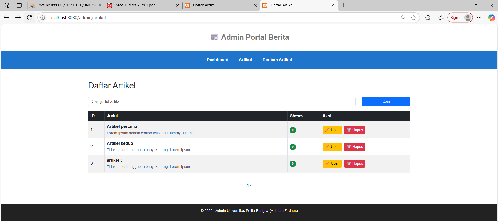
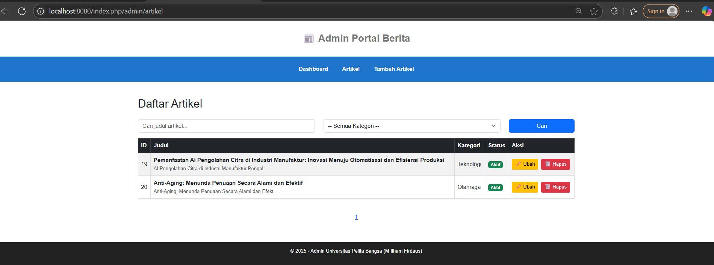
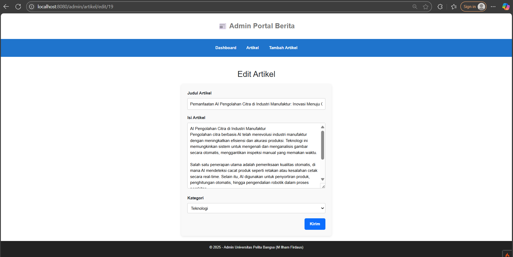
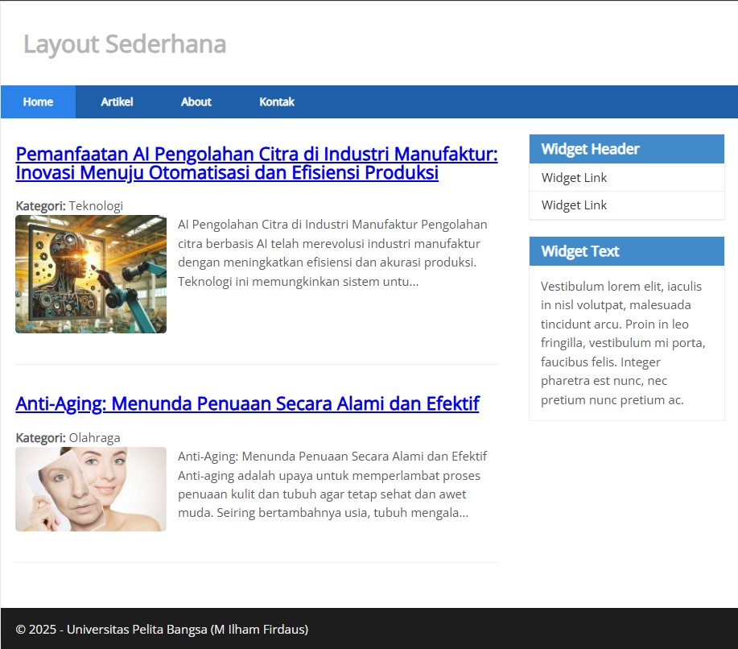
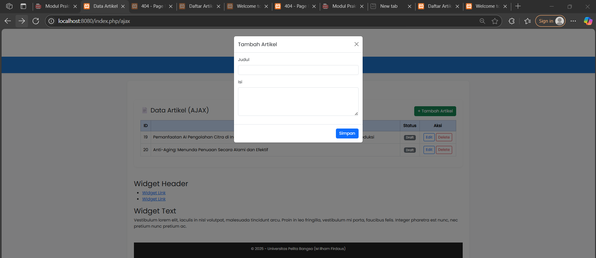
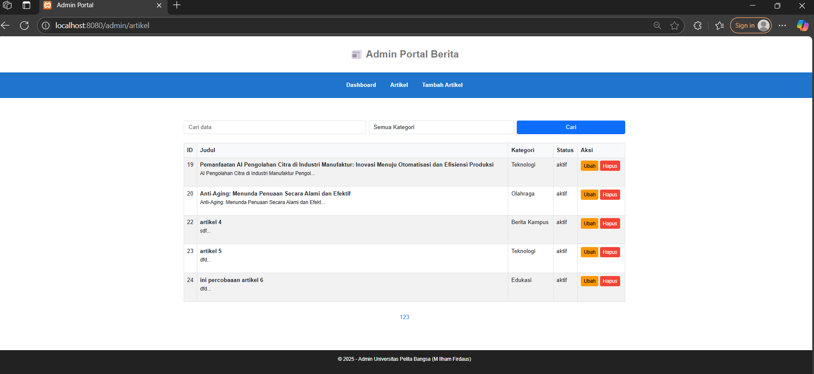
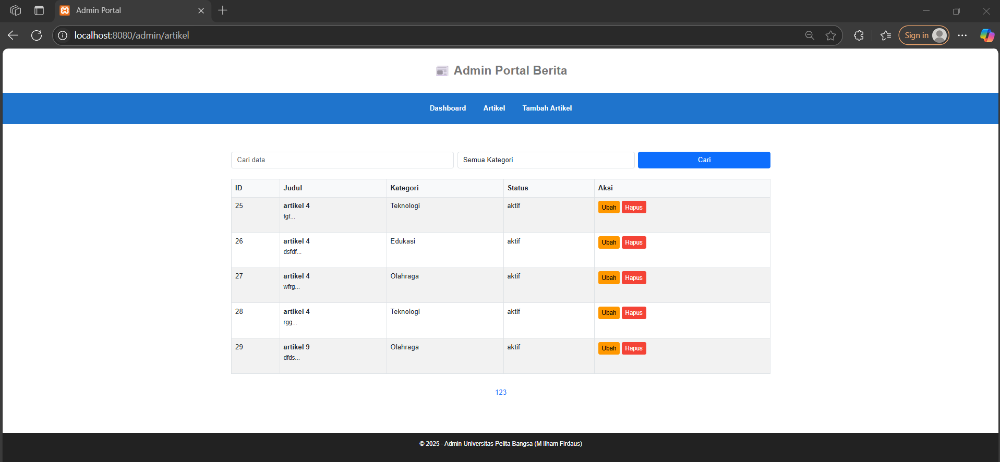
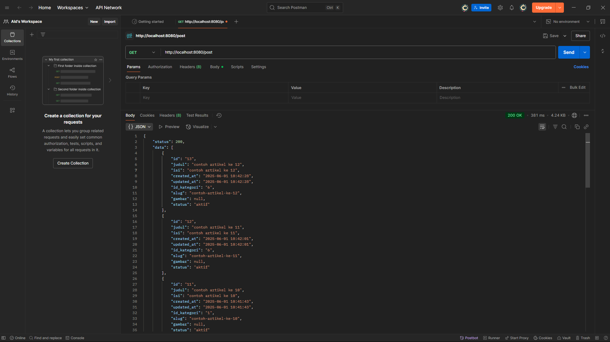
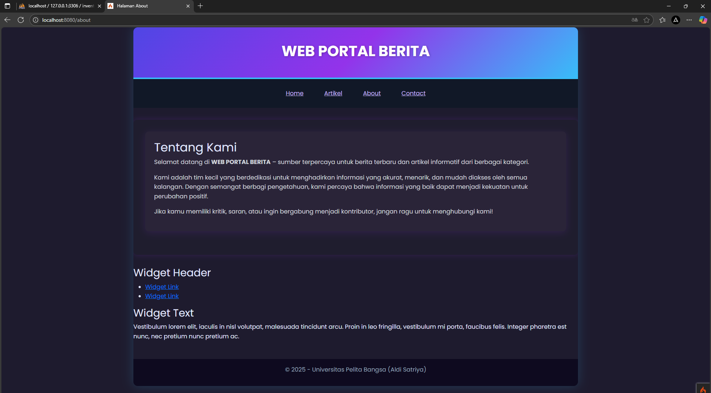

## Nama           : Aldi Satriya

## Kelas          : TI.23.C1

## NIM            : 312310759

## Mata Kuliah    : Pemrograman Web 2

## Dosen Pengampu : Agung Nugroho, S.Kom., M.Kom

## Universitas    : Universitas Pelita Bangsa


## Hasil Praktikum 1: PHP Framework (Codeigniter)


## Praktikum 2: Framework Lanjutan (CRUD)


## Praktikum 3: View Layout dan View Cell


Penjelasan

1. Manfaat View Layout: memudahkan pembuatan tampilan konsisten dan DRY (Don't Repeat Yourself).

2. Perbedaan View Cell vs View biasa:

  - View Biasa: hanya digunakan langsung di controller.

  - View Cell: bisa digunakan berulang kali seperti komponen/modul.

3. Modifikasi View Cell untuk hanya menampilkan post dengan kategori tertentu.


## Praktikum 4: Modul Login


## Praktikum 5 : Pagination dan Pencarian
### 1. Pagination
Saya mengedit controller Artikel untuk menampilkan daftar artikel menggunakan paginate(3) dan menampilkan pagination links di view.
**Screenshot:**

### 2. Pencarian
Saya menambahkan fitur pencarian dengan query `q`, melakukan filter `like('judul', $q)` dan menyesuaikan tampilan form di view.

**Screenshot:**


### 3. Uji Coba
- Pagination muncul saat data lebih dari 3.
- Pencarian berhasil menampilkan data yang relevan.

**Screenshot:**


## Praktikum 6: Upload File Gambar
- Menambahkan input file `gambar` di form `artikel/form_add.php`


- Menyesuaikan tag `<form>` dengan `enctype="multipart/form-data"`
  

- Mengupdate method `add()` pada `Artikel.php` untuk menyimpan file gambar ke folder `public/gambar`


- Menyimpan nama file gambar ke database


# Praktikum 7 - Relasi Tabel dan Query Builder

## Deskripsi
Modul ini membahas cara menghubungkan tabel artikel dan kategori menggunakan relasi One-to-Many di CodeIgniter 4, serta memanfaatkan Query Builder.

## Fitur
- Relasi One-to-Many antara artikel dan kategori.
- Tambah/Edit/Hapus artikel dengan pemilihan kategori.
- Tampilan daftar artikel dengan kategori.
- Filter dan pencarian artikel berdasarkan kategori.

## Screenshots
### Tampilan Daftar Artikel (Admin)


### Tambah Artikel


### Edit Artikel


### Tampilan Artikel di Halaman Depan


## Langkah Pengerjaan
1. Membuat tabel `kategori`
2. Menambahkan foreign key di tabel `artikel`
3. Membuat `KategoriModel`
4. Modifikasi `ArtikelModel` dan `Artikel Controller`
5. Modifikasi semua view
6. Testing fungsi: tambah, edit, hapus, filter artikel


# Praktikum 8 - AJAX dengan CodeIgniter 4

Modul ini membahas penggunaan AJAX untuk menampilkan dan menghapus data artikel tanpa reload halaman.

## 🚀 Fitur
- Menampilkan daftar artikel menggunakan AJAX
- Menghapus data artikel tanpa reload
- Mengedit data artikel tanpa reload
- Menggunakan jQuery sebagai library
- Menambahkan data artikel tanpa reload

## 📁 Struktur
- Controller: `AjaxController`
- View: `app/Views/ajax/index.php`
- Model: `ArtikelModel`
- jQuery: `public/assets/js/jquery-3.6.0.min.js`

## 📸 Screenshot
### Tabel Data Artikel


### Tombol Delete AJAX


### Tombol Edit AJAX


### Tombol +Tambah Artikel AJAX



# Modul 9 – AJAX Pagination & Search

**Nama:** Aldi Satriya  
**Kelas:** TI.23.C.1  
**Mata Kuliah:** Pemrograman Web 2  
**Universitas:** Pelita Bangsa

---

## 🎯 Tujuan Praktikum

- Menerapkan pencarian dan pagination dinamis menggunakan AJAX
- Meningkatkan UX aplikasi dengan tampilan real-time dan interaktif
- Menggunakan jQuery untuk permintaan data backend di CodeIgniter 4

---

## 🔧 Teknologi

- CodeIgniter 4
- Bootstrap 5
- jQuery 3.6+

---

## 🛠️ Langkah Pengerjaan

1. Modifikasi `admin_index()` pada controller `Artikel` untuk mendukung AJAX
2. Ubah `admin_index.php`:
   - Tambahkan form pencarian dan filter kategori
   - Tampilkan data artikel dan pagination dengan jQuery
3. Tambahkan indikator loading saat request
4. AJAX otomatis fetch data saat search dan filter berubah

---

## 🧪 Fitur yang Dibuat

| Fitur          | Status |
|----------------|--------|
| AJAX Search    | ✅     |
| AJAX Pagination| ✅     |
| Loading State  | ✅     |
| Kategori Filter| ✅     |

---

## 📸 Tampilan

| 1️⃣ | Tampilan awal halaman admin | Setelah membuka `/admin/artikel` |

| 2️⃣ | Setelah melakukan pencarian | Isi kolom search, klik "Cari" |

| 3️⃣ | Filter kategori aktif | Pilih kategori tertentu |

| 4️⃣ | Pagination AJAX berhasil | Klik halaman 2, data berubah tanpa reload |

---

# Praktikum 10 - Membuat REST API dengan CodeIgniter 4

Modul ini membahas bagaimana membuat RESTful API menggunakan CodeIgniter 4. Fokus utama adalah mengakses data artikel menggunakan metode HTTP seperti GET, POST, PUT, dan DELETE.

## 🚀 Fitur API

Menampilkan seluruh data artikel (GET /post)

Menampilkan artikel berdasarkan ID (GET /post/{id})

Menambahkan artikel baru (POST /post)

Mengubah data artikel (PUT /post/{id})

Menghapus artikel (DELETE /post/{id})

## 📁 Struktur Folder

app/
├── Controllers/
│   └── Post.php
├── Models/
│   └── PostModel.php
├── Config/
│   └── Routes.php

## ⚙️ Konfigurasi
### 1. Database
Pastikan tabel post di database memiliki kolom berikut:
CREATE TABLE `post` (
  `id` INT AUTO_INCREMENT PRIMARY KEY,
  `judul` VARCHAR(255),
  `isi` TEXT,
  `slug` VARCHAR(255),
  `status` TINYINT(1),
  `gambar` VARCHAR(255),
  `id_kategori` INT,
  `created_at` DATETIME DEFAULT CURRENT_TIMESTAMP,
  `updated_at` DATETIME DEFAULT CURRENT_TIMESTAMP ON UPDATE CURRENT_TIMESTAMP
);

### 2. Routing
Tambahkan ke app/Config/Routes.php:
$routes->resource('post');

### 3. PostModel (app/Models/PostModel.php)
namespace App\Models;

use CodeIgniter\Model;

class PostModel extends Model
{
    protected $table = 'post';
    protected $primaryKey = 'id';
    protected $allowedFields = ['judul', 'isi', 'slug', 'status', 'gambar', 'id_kategori'];
    protected $useTimestamps = true;
    protected $createdField  = 'created_at';
    protected $updatedField  = 'updated_at';
    protected $returnType = 'array';
}

### 4. Post Controller (app/Controllers/Post.php)
namespace App\Controllers;

use CodeIgniter\RESTful\ResourceController;
use App\Models\PostModel;

class Post extends ResourceController
{
    protected $model;

    public function __construct()
    {
        $this->model = new PostModel();
    }

    public function index()
    {
        return $this->respond(['status' => 200, 'data' => $this->model->findAll()]);
    }

    public function create()
    {
        $data = $this->request->getPost() ?: $this->request->getJSON(true);

        if (!isset($data['judul']) || !isset($data['isi'])) {
            return $this->failValidationErrors('Judul dan isi wajib diisi.');
        }

        $data['slug'] = url_title($data['judul'], '-', true);
        $this->model->insert($data);

        return $this->respondCreated(['status' => 201, 'messages' => ['success' => 'Artikel ditambahkan.']]);
    }

    public function show($id = null)
    {
        $data = $this->model->find($id);
        return $data ? $this->respond($data) : $this->failNotFound('Data tidak ditemukan.');
    }

    public function update($id = null)
    {
        if (!$this->model->find($id)) return $this->failNotFound('Data tidak ditemukan.');

        $data = $this->request->getRawInput();
        if (!isset($data['judul']) || !isset($data['isi'])) {
            return $this->failValidationErrors('Judul dan isi wajib diisi.');
        }

        $data['slug'] = url_title($data['judul'], '-', true);
        $this->model->update($id, $data);

        return $this->respond(['status' => 200, 'messages' => ['success' => 'Artikel berhasil diupdate.']]);
    }

    public function delete($id = null)
    {
        if (!$this->model->find($id)) return $this->failNotFound('Data tidak ditemukan.');

        $this->model->delete($id);
        return $this->respondDeleted(['status' => 200, 'messages' => ['success' => 'Artikel berhasil dihapus.']]);
    }
}

## 🔧 Pengujian API
Gunakan Postman atau REST client lainnya.

GET http://localhost:8080/post


GET http://localhost:8080/post/{id}


POST http://localhost:8080/post (form-data: judul, isi)


PUT http://localhost:8080/post/{id} (raw/json: judul, isi)


DELETE http://localhost:8080/post/{id}


AjaxController.php
ArtikelModel.php
Views/ajax/index.php
iews/ajax/artikel_list.php
app/Views/pagers/bootstrap.php

Updatedate


# Lab 11 Web - VueJS

Praktikum Pemrograman Web 2 - Universitas Pelita Bangsa  
Dosen: Agung Nugroho  
Modul Praktikum 11: Frontend API menggunakan VueJS 3

## 🎯 Tujuan Praktikum
1. Memahami konsep dasar API.
2. Memahami konsep dasar Framework VueJS.
3. Mampu membuat aplikasi frontend menggunakan VueJS 3 yang terhubung dengan API backend.

---

## 🛠️ Persiapan
- Text Editor: Visual Studio Code
- Browser: Google Chrome / lainnya
- Webserver: XAMPP/Laragon (untuk backend CI4 API)

**Struktur Folder:**
```
lab8_vuejs/
├── index.html
└── assets/
    ├── css/
    │   └── style.css
    └── js/
        └── app.js
```

---

## 📄 Langkah-langkah Praktikum

### 1. Membuat Tampilan Awal
- File: `index.html`
- Menampilkan daftar artikel yang diambil dari endpoint API menggunakan `axios`.

### 2. Menambahkan Form Tambah & Edit Data
- Form dinamis ditampilkan menggunakan `v-if`.
- Form memanfaatkan `v-model` untuk binding data.

### 3. Script VueJS (app.js)
- Menggunakan `Vue.createApp()` untuk membuat instance aplikasi.
- Method utama:
  - `loadData()` – memuat data dari API
  - `tambah()` – membuka form tambah
  - `edit(data)` – membuka form edit dan mengisi datanya
  - `hapus(index, id)` – menghapus data berdasarkan ID
  - `saveData()` – menyimpan data ke backend (POST/PUT)
  - `statusText(status)` – mengubah nilai status menjadi teks

### 4. Styling (style.css)
- Desain tabel dan form menggunakan CSS sederhana.
- Menambahkan modal form menggunakan class `.modal`.

---

## 🔧 Teknologi yang Digunakan
- [VueJS 3 CDN](https://unpkg.com/vue@3)
- [Axios](https://unpkg.com/axios)
- HTML, CSS
- Backend API menggunakan CodeIgniter 4

---

## 📸 Screenshot Hasil
 Sisipkan screenshot tampilan : 
1️⃣ daftar artikel

2️⃣ form tambah

3️⃣ form edit

4️⃣ hasil simpan/hapus


---

## 💡 Catatan Tambahan
- Pastikan backend CodeIgniter 4 (labci4) sudah aktif dan endpoint `http://localhost/labci4/public/post` berjalan dengan baik.
- Gunakan CORS jika mengakses API dari domain berbeda.
- Form reset otomatis setelah simpan dan modal ditutup.

---

© 2025 Universitas Pelita Bangsa

# 📰 Admin Portal Berita — UI/UX Update Galaxy Theme

Selamat datang di proyek **Admin Portal Berita**!  
Repository ini merupakan dokumentasi pembaruan tampilan **UI/UX** dengan tema **Galaxy** ✨ yang modern dan responsif.

---

## 🚀 Update Terbaru

### 🔧 Struktur Update UI/UX

#### 📁 `/admin/artikel/`

1. **Dashboard**  
   - Redesain total dengan tema gelap Galaxy.
   - Integrasi Chart.js untuk statistik artikel.
   - Layout responsif dan navigasi bar yang lebih interaktif.
   

2. **Artikel (Manajemen Artikel)**  
   - Tampilan daftar artikel kini lebih elegan dan mudah dibaca.
   - Efek hover dan transisi antar elemen.
   - Penggunaan card & table Bootstrap untuk data.
      

3. **Tambah Artikel**  
   - Form input artikel dengan tata letak bersih dan terang.
   - Validasi input & UX form yang ramah pengguna.
         

---

#### 📁 `/artikel/`

1. **Home**  
   - Tampilan awal pengunjung dengan typography kuat.
   - Background Galaxy dan struktur hero section.
            

2. **Artikel (Publik)**  
   - Tampilan artikel individual & list dengan layout konten yang fokus pada kenyamanan membaca.
   - Navigasi antar artikel yang lebih smooth.
         

3. **About**  
   - Informasi tentang website & tim pengembang dengan struktur single-column.
         

4. **Contact**  
   - Form kontak minimalis dengan tema gelap.
   - Feedback interaktif (terima kasih, validasi form).
            

---

## 🌌 Teknologi Digunakan

- **HTML5 + CSS3**
- **Bootstrap 5.3**
- **Chart.js + Chart.js DataLabels**
- **PHP (CodeIgniter / Native PHP Compatible)**
- **Responsive Web Design**
- **Galaxy-style UI (Dark mode, Gradient, Stars)**

---

