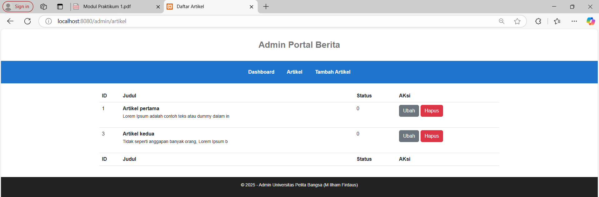

## Nama           : Aldi Satriya

## Kelas          : TI.23.C1

## NIM            : 312310759

## Mata Kuliah    : Pemrograman Web 2

## Dosen Pengampu : Agung Nugroho, S.Kom., M.Kom

## Universitas    : Universitas Pelita Bangsa

## Hasil Praktikum 1: PHP Framework (Codeigniter)

## Praktikum 2: Framework Lanjutan (CRUD)

## Praktikum 3: View Layout dan View Cell

Penjelasan

1. Manfaat View Layout: memudahkan pembuatan tampilan konsisten dan DRY (Don't Repeat Yourself).

2. Perbedaan View Cell vs View biasa:

  - View Biasa: hanya digunakan langsung di controller.

  - View Cell: bisa digunakan berulang kali seperti komponen/modul.

3. Modifikasi View Cell untuk hanya menampilkan post dengan kategori tertentu.

## Praktikum 4: Modul Login

## Praktikum 5 : Pagination dan Pencarian
### 1. Pagination
Saya mengedit controller Artikel untuk menampilkan daftar artikel menggunakan paginate(3) dan menampilkan pagination links di view.
**Screenshot:**

### 2. Pencarian
Saya menambahkan fitur pencarian dengan query `q`, melakukan filter `like('judul', $q)` dan menyesuaikan tampilan form di view.

**Screenshot:**

### 3. Uji Coba
- Pagination muncul saat data lebih dari 3.
- Pencarian berhasil menampilkan data yang relevan.

**Screenshot:**

## Praktikum 6: Upload File Gambar
- Menambahkan input file `gambar` di form `artikel/form_add.php`

- Menyesuaikan tag `<form>` dengan `enctype="multipart/form-data"`
  

- Mengupdate method `add()` pada `Artikel.php` untuk menyimpan file gambar ke folder `public/gambar`

- Menyimpan nama file gambar ke database
